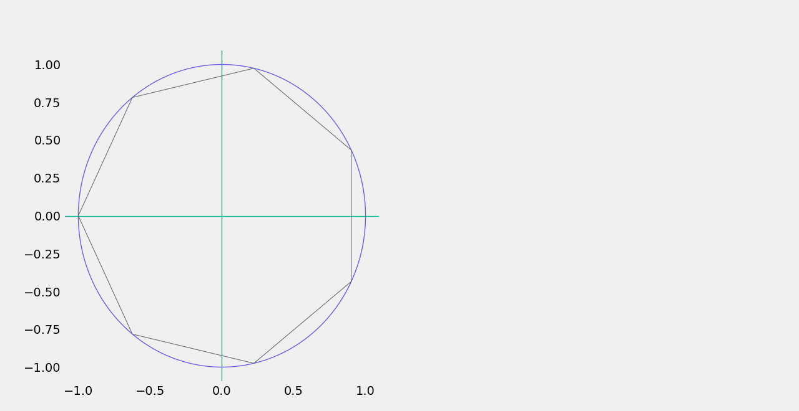
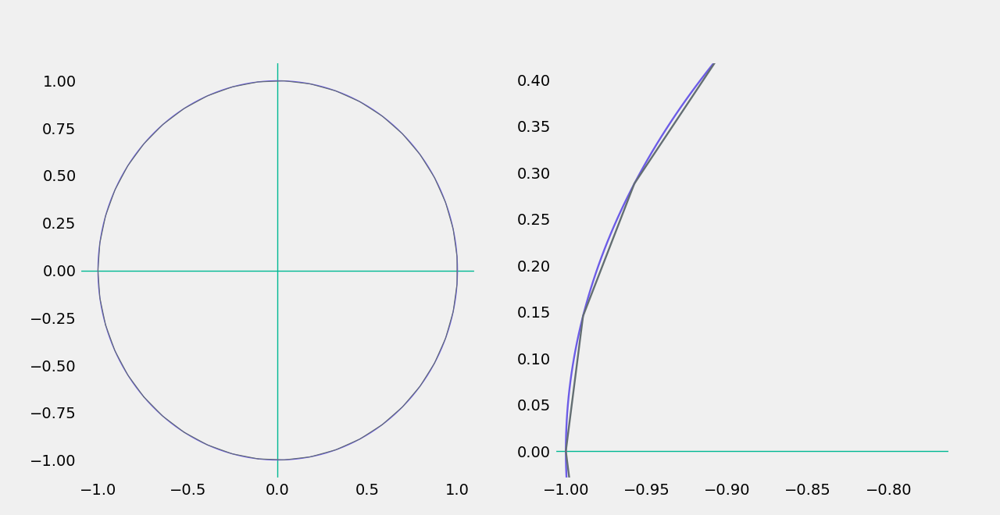

<!DOCTYPE html>
<html lang="en">
<head>
    <meta charset="UTF-8">
    <meta name="viewport" content="width=device-width, initial-scale=1.0">
</head>
<body>

<h1>Polygon Tool</h1>

<h2>Overview</h2>

This repository contains a Python tool for creating any n-sided regular polygon

<h2>Samples</h2>

<strong>7-sided Regular Polygon</strong>

<strong>43-sided Regular Polygon</strong>

As the number of sides increases, the polygon approximates a circle.

<h2>Usage</h2>

To create a polygon, run the <code>polygon.py</code> script:

<pre>
<code>python polygon.py -sides &lt;number_of_sides&gt;</code>
</pre>

<h2>Resources</h2>

For a detailed code walkthrough and theoretical explanation, watch <a href="https://www.youtube.com/watch?v=zXMgxr5oLSQ">this video</a>.

</body>
</html>
